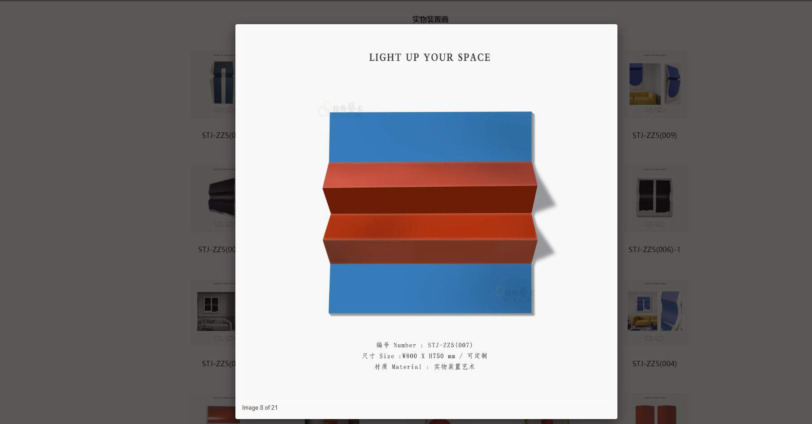

# 一个jq的网页版改vue
## 接口在本地测试环境需要开启浏览器CORS跨域插件

### 完成效果图

## 首页效果


## 产品详情页


## 产品详情页点击图片预览



=============

# default

## Project setup
```
npm install
```

### Compiles and hot-reloads for development
```
npm run serve
```

### Compiles and minifies for production
```
npm run build
```

### Run your tests
```
npm run test
```

### Lints and fixes files
```
npm run lint
```

### Customize configuration
See [Configuration Reference](https://cli.vuejs.org/config/).


